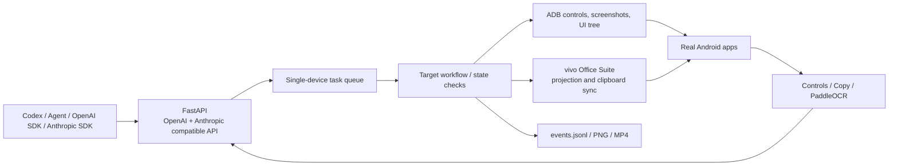

# FreeCoding


[](https://github.com/Damue01/FreeCoding/actions/workflows/ci.yml)

FreeCoding 将真实 Android 应用中的 AI 对话能力转换为统一的 OpenAI 和 Anthropic 兼容 HTTP API。目前已经接入美团“小团”、《王者荣耀》“灵宝”和抖音/多闪“小火人”，可以被 Codex、OpenAI SDK、Anthropic SDK 或其他支持这些协议的 Agent 调用。

项目不调用目标应用的私有接口，不绕过登录，也不使用视觉大模型临时操控页面。所有运行步骤都沉淀为可复现的 Python 代码，通过 ADB、Android 控件树、剪贴板同步和 PaddleOCR 完成。执行期间手机和电脑投屏会保留真实应用画面，并生成点击记录、识别结果、截图、录屏和事件日志，便于调试、演示和审计。

> [!IMPORTANT]
> FreeCoding 仍处于 Alpha 阶段。当前配置针对一台 vivo 真机及特定应用版本完成校准，应用升级、分辨率变化或不同手机系统可能需要重新调整控件 ID、OCR 区域或点击坐标。

## 目录

- [为什么使用真实 vivo 手机](#为什么使用真实-vivo-手机)
- [已支持的模型](#已支持的模型)
- [功能特性](#功能特性)
- [系统架构](#系统架构)
- [运行环境](#运行环境)
- [快速开始](#快速开始)
- [配置说明](#配置说明)
- [API 使用](#api-使用)
- [接入 Codex](#接入-codex)
- [三个目标的实现细节](#三个目标的实现细节)
- [常见问题](#常见问题)
- [安全、隐私与免责声明](#安全隐私与免责声明)
- [贡献](#贡献)
- [开源协议](#开源协议)

## 为什么使用真实 vivo 手机

当前实现使用 **vivo 办公套件（vivo 互联/手机投屏）+ USB ADB**，没有采用 Android 模拟器。

选择真机主要是出于账号安全和运行真实性考虑：

- 复用用户已经登录的官方应用和现有会话，不复制账号凭据。
- 避免模拟器环境、设备指纹差异或重复登录增加账号风控概率。
- 不抓取、不研究目标应用的私有网络协议，也不绕过人脸识别或其他安全校验。
- 投屏端始终能看到真实页面、点击过程和回复结果，便于人工随时接管。

真机方案不能消除第三方平台的全部风控或服务条款风险。请只在自己拥有或明确获授权的设备、账号和会话上使用本项目。

## 已支持的模型

| 目标 | OpenAI model | 输入方式 | 回复提取 |
| --- | --- | --- | --- |
| 美团“小团” | `meituan_xiaotuan` | 原生输入框 + Unicode 剪贴板粘贴 | 优先复制按钮，其次控件文本，最后 OCR |
| 王者荣耀“灵宝” | `wangzhe_lingbao` | 聚焦 Unity 页面临时创建的原生 `EditText` 后粘贴 | 固定回答区域的分片 OCR |
| 抖音/多闪“小火人” | `douyin_xiaohuoren` | 输入 `@` 并选择真实“小火人”提及，再追加问题 | 普通气泡读控件；内容卡片进入详情后复制全文 |

每个模型复用对应应用当前的物理会话，因此支持连续对话。API 只发送本轮最新问题，历史上下文仍保存在目标应用内。

## 功能特性

- OpenAI Responses API、Chat Completions API 和 Anthropic Messages API。
- 原生异步作业 API、单设备任务队列和超时控制。
- Android 控件树、剪贴板、OCR 三层回复提取策略。
- 中文 Unicode 输入，不安装额外 Android 输入法。
- 页面状态校验、固定坐标保护、稳定帧检测和失败重试。
- 浏览器演示面板、Swagger 文档、SSE 事件流。
- 最终截图、操作日志和 Android 屏幕录制。
- `mock` 驱动和自动化测试，不连接手机也能开发协议层。
- Codex 自定义 Provider 配置，无需额外 API Key 验证。

## 系统架构



当前代码没有依赖 Airtest、MaaFramework 或视觉大模型。驱动直接使用 ADB 和确定性规则，以减少运行时的不确定性。

## 运行环境

### 电脑

- Windows 10 或 Windows 11。
- Python 3.11，建议使用 64 位官方 Python。
- vivo 办公套件，并已启用手机投屏和剪贴板同步。
- 可用的 USB 接口；无线 ADB 也可使用，但尚未作为主要验证路径。

### 手机

- 支持 vivo 办公套件的 vivo Android 手机。
- 已启用开发者选项和 USB 调试。
- 手机保持解锁，目标应用已安装并登录。
- 美团“小团”、王者荣耀“灵宝”或抖音/多闪“小火人”页面可以手动正常对话。

### Python 依赖

- FastAPI、Uvicorn、Pydantic Settings。
- PaddleOCR、PaddlePaddle、OpenCV Contrib。
- 开发和测试额外使用 pytest、HTTPX。

仓库不分发 ADB 二进制文件。请从 [Google 官方 Android SDK Platform-Tools](https://developer.android.com/tools/releases/platform-tools) 下载 Windows 版本，将其解压到本地 `tools/adb/`，或在 `.env` 中把 `APP2API_ADB_PATH` 设置为已有 `adb.exe` 的绝对路径。`tools/` 已被 Git 忽略，不会把第三方二进制误提交到仓库。

## 快速开始

### 一键启动（Windows）

克隆或下载仓库后，直接双击根目录的 [`start_freecoding.bat`](start_freecoding.bat)。脚本会：

- 始终从 FreeCoding 项目目录启动，避免相对路径失效；
- 使用项目内的 `.venv`，首次运行时自动创建并安装运行依赖；
- 在缺少 `.env` 时从 `.env.example` 创建一份本地配置；
- 检测 8000 端口上的 FreeCoding 是否已经运行，避免重复启动；
- 启动本地 API 并打开演示页面，窗口中按 `Ctrl+C` 即可停止。

首次生成的 `.env` 使用 `mock` 驱动，可以直接查看接口和演示页面。连接 vivo 真机前仍需按下文填写 ADB 路径、设备序列号和 `vivo_adb` 驱动。

### 1. 获取代码并创建虚拟环境

```powershell
cd FreeCoding
python -m venv .venv
.\.venv\Scripts\Activate.ps1
python -m pip install --upgrade pip
python -m pip install -e ".[ocr,client,dev]"
```

如果只开发 API 协议而不连接真机，可以安装基础依赖并使用默认的 `mock` 驱动：

```powershell
python -m pip install -e ".[dev]"
```

### 2. 创建本地配置

```powershell
Copy-Item .env.example .env
```

编辑 `.env`，真实 vivo 手机至少需要修改以下内容：

```dotenv
APP2API_DRIVER=vivo_adb
APP2API_ENABLED_TARGETS=meituan,lingbao,xiaohuoren
APP2API_ADB_PATH=tools\adb\adb.exe
APP2API_ADB_SERIAL=你的设备序列号
APP2API_VIVO_WINDOW_PROCESS=vivoScreen.exe
```

查找设备序列号：

```powershell
.\tools\adb\adb.exe devices -l
```

如果使用系统安装的 ADB，也可以将 `APP2API_ADB_PATH` 设置为绝对路径。

### 3. 准备 vivo 办公套件和手机

1. 使用 USB 连接电脑与手机，并在手机上允许 USB 调试。
2. 启动 vivo 办公套件，确认电脑能看到并操作手机投屏。
3. 开启电脑和手机之间的剪贴板同步。
4. 保持手机解锁，并手动打开目标对话页面。

不同目标的页面要求：

- **小团**：建议停留在美团问小团对话页；页面失效时驱动会尝试从美团入口恢复。
- **灵宝**：必须停留在灵宝对话页，并使用配置中的固定横屏分辨率 `3200x1440`。
- **小火人**：必须由用户先打开正确的聊天页。驱动不会启动抖音、返回聊天列表或猜测联系人，避免进入错误会话。

`app2api/target_configs/xiaohuoren.json` 中的 `my.maya.android` 是当前 vivo 应用分身生成的包名。使用官方抖音或其他分身方案时，请通过 `adb shell pm list packages` 确认包名并修改 `app_id`。

### 4. 运行检查

以下命令不会发送聊天消息：

```powershell
freecoding devices
freecoding diagnostics
freecoding preflight
```

捕获当前页面、控件和 OCR 结果用于校准：

```powershell
freecoding capture --target meituan --skip-start
freecoding capture --target lingbao --skip-start
freecoding capture --target xiaohuoren --skip-start
```

校准结果默认写入 `runtime/calibration/`。

### 5. 启动服务

```powershell
freecoding serve
```

指定监听地址和端口：

```powershell
freecoding serve --host 127.0.0.1 --port 8000
```

启动后可访问：

- 演示面板：<http://127.0.0.1:8000/>
- Swagger：<http://127.0.0.1:8000/docs>
- 健康检查：<http://127.0.0.1:8000/health>

## 配置说明

所有环境变量均以 `APP2API_` 开头。

| 变量 | 示例/默认值 | 说明 |
| --- | --- | --- |
| `APP2API_DRIVER` | `mock` / `vivo_adb` | 自动化驱动；真机使用 `vivo_adb` |
| `APP2API_ENABLED_TARGETS` | `meituan,lingbao,xiaohuoren` | 启用的目标和模型 |
| `APP2API_ADB_PATH` | `tools\adb\adb.exe` | ADB 可执行文件路径 |
| `APP2API_ADB_SERIAL` | `10ADB...` | `adb devices -l` 返回的设备序列号 |
| `APP2API_VIVO_WINDOW_PROCESS` | `vivoScreen.exe` | vivo 投屏窗口进程名 |
| `APP2API_VIVO_WINDOW_TITLE_RE` | `.*` | vivo 投屏窗口标题正则表达式 |
| `APP2API_VIVO_CLIPBOARD_SYNC_SECONDS` | `2.5` | 等待剪贴板同步的秒数 |
| `APP2API_CONFIG_DIR` | `app2api/target_configs` | 目标工作流配置目录 |
| `APP2API_ARTIFACT_DIR` | `runtime/artifacts` | 截图、录屏和日志目录 |
| `APP2API_RECORDING_ENABLED` | `true` | 是否录制每次真实任务 |
| `APP2API_WORKERS` | `1` | 队列工作数；一部手机建议保持为 `1` |
| `APP2API_JOB_TIMEOUT_SECONDS` | `120` | 单个任务总超时时间 |
| `APP2API_EVENT_HISTORY` | `500` | 内存中保留的事件数量 |

每个目标的控件 ID、OCR 区域、固定坐标和超时位于 `app2api/target_configs/*.json`，并会随 Python 包一同安装。应用升级或设备分辨率变化后，应先运行 `freecoding capture`，再校准这些配置；也可以通过 `APP2API_CONFIG_DIR` 指向一份外部配置副本。

## API 使用

### OpenAI 兼容信息

```text
Base URL: http://127.0.0.1:8000/v1
API Key: 任意非空字符串；当前本地服务不校验
Models: meituan_xiaotuan, wangzhe_lingbao, douyin_xiaohuoren
```

支持：

- `GET /v1/models`
- `GET /v1/models/{model_id}`
- `POST /v1/responses`
- `POST /v1/chat/completions`

### Anthropic Messages 兼容信息

```text
Base URL: http://127.0.0.1:8000
API Key: 任意非空字符串；当前本地服务不校验
Version header: anthropic-version: 2023-06-01
Models: meituan_xiaotuan, wangzhe_lingbao, douyin_xiaohuoren
```

支持 `POST /v1/messages` 的普通 JSON 返回和 `stream=true` SSE 返回。返回结构包含 Anthropic Messages 客户端常用的 `message`、文本内容块、`stop_reason`、`usage`、错误对象和 `request-id` 响应头。

### OpenAI Python SDK

```python
from openai import OpenAI

client = OpenAI(
    base_url="http://127.0.0.1:8000/v1",
    api_key="local",
)

response = client.responses.create(
    model="douyin_xiaohuoren",
    input="请只用一句话介绍你自己",
)

print(response.output_text)
```

Chat Completions 同样可用：

```python
completion = client.chat.completions.create(
    model="meituan_xiaotuan",
    messages=[{"role": "user", "content": "上海哪里适合散步？"}],
)

print(completion.choices[0].message.content)
```

### Anthropic Python SDK

安装项目的 `client` 可选依赖后，可以直接使用 Anthropic SDK：

```python
from anthropic import Anthropic

client = Anthropic(
    base_url="http://127.0.0.1:8000",
    api_key="local",
)

message = client.messages.create(
    model="meituan_xiaotuan",
    max_tokens=1024,
    messages=[
        {"role": "user", "content": "上海哪里适合散步？"},
    ],
)

print(message.content[0].text)
```

Anthropic 兼容层当前面向纯文本对话。它接收标准 `system`、历史 `messages` 和生成参数，但只把最后一条 `user` 文本发送给真实应用；连续对话上下文由手机里的当前应用会话维护。工具调用、图片输入、仅有非文本内容的最后一条消息和 assistant 预填充暂不支持，并会返回 Anthropic 格式错误。目标应用无法提供可靠 token 计数，因此 `usage` 暂时报告为 `0`。

`stream=true` 会在真实应用回复提取完成后，以标准 SSE 格式分块返回文本；它不是目标应用生成过程中的实时 token 流。

### 原生作业 API

原生接口适合演示面板、日志观察和异步任务管理：

- `POST /v1/ask`
- `GET /v1/jobs`
- `GET /v1/jobs/{job_id}`
- `GET /v1/jobs/{job_id}/events`
- `GET /v1/jobs/{job_id}/frame`
- `GET /v1/jobs/{job_id}/artifacts/{name}`
- `GET /v1/jobs/{job_id}/stream`
- `GET /v1/system/diagnostics`
- `GET /v1/system/devices`
- `GET /v1/system/preflight`

PowerShell 示例：

```powershell
$body = @{
    target = "meituan"
    question = "请推荐一个适合散步的公园"
    wait = $true
    timeout_seconds = 120
} | ConvertTo-Json

Invoke-RestMethod `
    -Uri "http://127.0.0.1:8000/v1/ask" `
    -Method Post `
    -ContentType "application/json; charset=utf-8" `
    -Body $body
```

## 接入 Codex

编辑用户目录下的 `C:\Users\你的用户名\.codex\config.toml`：

```toml
model = "douyin_xiaohuoren"
model_provider = "FreeCoding"
model_reasoning_effort = "medium"

[model_providers.FreeCoding]
name = "FreeCoding"
base_url = "http://127.0.0.1:8000/v1"
wire_api = "responses"
```

不要配置 `env_key`、`experimental_bearer_token` 或 `requires_openai_auth`。这样不会改变 Codex 原有登录状态，登录令牌也不会发送给本地 Provider。

验证 Provider 和模型目录：

```powershell
codex --strict-config doctor --summary --no-color
codex debug models
```

修改配置后重启 Codex，再使用 `/model` 在三个模型之间切换。FreeCoding 返回的模型元数据会关闭 skills 使用说明，避免把大量 Codex skills 文本发送给只负责应用对话的模型。

> [!NOTE]
> 这些应用模型只返回文本，不具备 Codex 原生编码模型的工具调用、Shell 操作或文件编辑能力。它们适合作为对话来源，不等同于完整的编码 Agent。

## 三个目标的实现细节

### 美团“小团”

1. 优先检查当前问小团页面是否具有有效会话标记。
2. 通过 Android 原生输入框和 vivo 剪贴板同步注入中文。
3. 等待回答完成，优先点击回答下方复制按钮。
4. 剪贴板不可用时读取回答控件原文，最后才使用 OCR。
5. 原始 Markdown 和换行会尽量保持，不转换为 HTML。

### 王者荣耀“灵宝”

1. 使用 OCR 校验当前是否为灵宝页面和固定分辨率。
2. 点击 Unity 输入区域，等待游戏临时创建真正的 Android `EditText`。
3. 通过系统粘贴键输入中文并再次读取控件树验证内容。
4. 从左侧回答区域横向分片、放大 OCR，再合并重叠文本。
5. 过滤右侧用户气泡、顶部卡片和底部快捷按钮。

### 抖音/多闪“小火人”

1. 用真实截图确认用户选择的聊天页仍然可见。
2. 输入 `@`，点击控件树中的“小火人”候选，形成真实提及标记。
3. 普通回复从当前问题之后的左侧气泡读取。
4. 出现内容卡片时，严格执行：点击卡片并确认详情 Activity、滚动到底部、OCR 定位复制、确认剪贴板取得完整文本、最后返回原聊天页。
5. 卡片未打开或复制未确认时不会执行返回，防止误退到聊天列表。

## 连续对话与并发限制

- 一部手机上的每个目标对应一段共享的真实会话。
- 页面有效时不会为每个 API 请求重新启动应用或从首页导航。
- 当前队列面向单设备串行执行；不建议多个互不相关的 Agent 并发共享同一手机。
- 若要支持多用户，应为每台设备建立独立队列、会话路由和授权边界。

## 运行产物

真实任务会写入 `runtime/artifacts/{job_id}/`：

```text
events.jsonl      状态、点击、重试、识别和错误事件
final-frame.png   任务结束时的真实手机截图
session.mp4       Android 屏幕录制（启用录制时）
```

`runtime/`、`artifacts/`、`.env`、虚拟环境和 Python 缓存均被 `.gitignore` 排除。发布或提交前仍应人工检查仓库中是否包含聊天内容、账号信息、截图、录屏或设备序列号。

## 开发与测试

```powershell
python -m pip install -e ".[ocr,client,dev]"
pytest -q
freecoding diagnostics
```

测试默认使用 `mock` 驱动，不会操作手机。真机端到端测试会实际发送消息，建议使用专门的测试会话并人工观察投屏。

项目目录：

```text
app2api/            FastAPI、队列、协议、工作流与驱动
app2api/drivers/    mock 和 vivo ADB 驱动
app2api/target_configs/  三个目标的页面、输入和提取配置
scripts/            本地调用示例
tests/              API、协议、设备、工作流和控件提取测试
tools/adb/          当前验证环境使用的最小 ADB 文件
runtime/            本地运行产物，不进入版本控制
```

## 常见问题

### ADB 找不到手机

- 在手机上重新确认 USB 调试授权。
- 运行 `adb kill-server`、`adb start-server` 后再执行 `freecoding devices`。
- 检查 `.env` 中的 `APP2API_ADB_SERIAL` 是否和 `adb devices -l` 完全一致。

### 找不到 vivo 投屏窗口

- 确认 vivo 办公套件正在运行并已打开手机投屏。
- 在任务管理器中核对实际进程名，并更新 `APP2API_VIVO_WINDOW_PROCESS`。
- 如果有多个窗口，用 `APP2API_VIVO_WINDOW_TITLE_RE` 缩小匹配范围。

### 中文没有进入输入框

- 确认 vivo 剪贴板同步已打开。
- 保持手机和投屏窗口解锁、可操作。
- 适当增加 `APP2API_VIVO_CLIPBOARD_SYNC_SECONDS`。
- 用 `freecoding capture --target ... --skip-start` 检查输入框是否仍在控件树中。

### OCR 结果不完整或点击偏移

- 检查手机分辨率、横竖屏和系统显示缩放是否变化。
- 重新校准目标 JSON 中的 `ocr_region`、分片宽度和点击坐标。
- 确认 PaddleOCR 和 OpenCV 安装成功，再运行 `freecoding diagnostics`。

### Codex 的 `/model` 看不到模型

- 先确认 `http://127.0.0.1:8000/v1/models` 返回三个模型。
- 运行 `codex debug models` 检查 Provider 模型目录。
- 确认 Provider 名称和 `model_provider = "FreeCoding"` 大小写一致。
- 修改配置后完全退出并重启 Codex。

## 安全、隐私与免责声明

- API 当前不验证密钥，只应监听 `127.0.0.1`。如需局域网或公网访问，必须增加鉴权、TLS、访问控制和速率限制。
- `.env` 可能包含设备序列号；运行产物可能包含私人聊天内容。不要提交这些文件。
- 开启 USB 调试会扩大设备攻击面，完成使用后应关闭不需要的调试连接。
- 第三方应用界面、控件和策略可能随时变化，也可能禁止自动化操作。使用者应自行遵守适用的服务条款、法律和账号规则。
- 本项目与美团、腾讯、王者荣耀、抖音、字节跳动或 vivo 无隶属、授权或背书关系。相关名称和商标归各自权利人所有。
- 本项目不提供绕过登录、人脸识别、验证码、风控或其他安全机制的能力。

## 路线图

- 将设备、包名和页面校准参数进一步外部化。
- 增加多设备队列与会话隔离。
- 增加可复用的模板采集和可视化校准工具。
- 为应用版本变化增加更清晰的兼容性报告。
- 增加 GitHub Actions、代码风格检查和可重复的发布流程。

## 贡献

欢迎提交 Issue 和 Pull Request。建议在提交问题时提供以下信息，并注意隐藏个人数据：

- Windows、Python、手机型号和应用版本。
- 目标页面分辨率和横竖屏状态。
- `freecoding diagnostics` 输出。
- 已脱敏的错误日志、控件树或截图。

安全问题请不要提交公开 Issue，报告方式见 [SECURITY.md](SECURITY.md)。
- 可以稳定复现问题的最小步骤。

提交代码前请至少运行：

```powershell
pytest -q
```

## 开源协议

FreeCoding 使用 [MIT License](LICENSE) 开源。

Copyright © 2026 [damue042](mailto:damue0@outlook.com).
